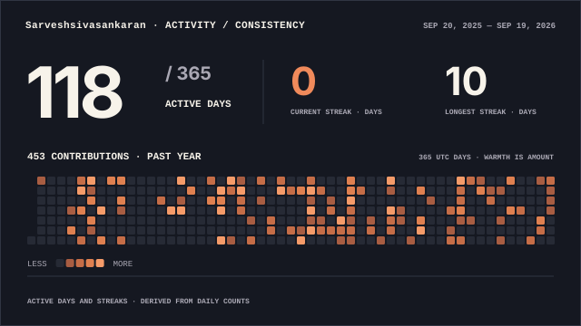
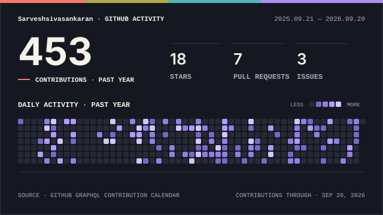
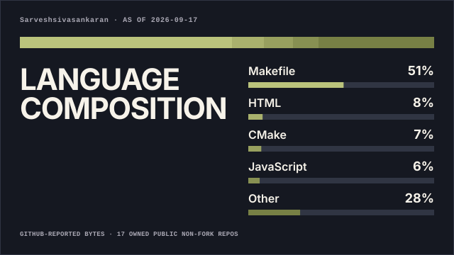

<h1 align="center">
  
</h1>

<div align="center">
  
  <a href="mailto:sarveshsivasankaran@gmail.com">
    
  </a>
  
  <a href="https://www.linkedin.com/in/sarvesh-sivasankaran/">
    
  </a>
  
  <a href="https://github.com/Sarveshsivasankaran">
    
  </a>
  
  <a href="https://leetcode.com/u/Sarvesh_Sivasankaran/">
    
  </a>

</div>

<hr></hr>

## 🧑‍💻 About Me


```javascript
const sarvesh = {
  role:      "CSE Student | IoT & AI/ML Builder",
  location:  "Chennai, Tamil Nadu 🇮🇳",
  education: "B.E. Computer Science Engineering",
  college:   "Rajalakshmi Engineering College",
  stack:     ["Python", "C", "Java", "MongoDB",
              "Firebase", "Supabase"],
  interests: ["IoT", "AI/ML", "Edge AI", "Robotics"],
  passion:   "Building tech that solves real problems",
  motto:     "Level Up. Build. Repeat. ⚡"
};
```
<div align="left">
  
- 🚀 Currently building AI + IoT + Robotics Projects
- 🤖 Exploring AI Agents · Edge AI · RAG · Computer Vision
- 🛰️ Working on SAR-V — Autonomous Search & Rescue Vehicle
- 💡 Vice President @ Intellexa REC
- 👨‍💻 Organizer @ CodeSapiens
- ⚡ Fun fact: I don't just build projects — I keep adding features until they become ecosystems 😂

</div>

<br>

> *“I don’t wait for opportunities. I build systems that create them.”*
<br/>

<hr></hr>

<div align="left">
  
# 💻 Tech Stack:
                                    

</div>
<br/>

<hr></hr>

## 💼 Work Experience

<table>
<tr>

<td width="50%" valign="top">

### 🏢 Hyle Global
<code>AI Engineer Intern</code> · <code>Jul 2026 – Sep 2026</code>

- Built and explored **AI-powered solutions**
- Worked with **AI/ML workflows & model integration**
- Developed intelligent application features
- Worked with APIs and data processing pipelines
- Gained hands-on **AI Engineering** experience

</td>

<td width="50%" valign="top">

### 🏢 Tata Consultancy Services (TCS)
<code>Upcoming AI Engineer Intern</code> · <code>Upcoming</code>

- Selected through the **TCS AI Immersion Hackathon**
- 🏆 **Rank 5 / 603 participants**
- Upcoming exposure to enterprise **AI Engineering**
- Focused on **AI/ML & intelligent systems**
- Preparing to build scalable AI solutions

</td>

</tr>
</table>

<hr></hr>

## 🚀 Featured Projects

| 🔥 Project | 🛠️ Stack | 📌 Impact |
| :--- | :--- | :--- |
| 🤖 [**SAR-V**](YOUR_SARV_REPO_LINK) | Edge AI · YOLO · Q6A · LiDAR · LoRa | Multi-terrain autonomous disaster-response system |
| ⚡ [**Visualec**](https://github.com/Sarveshsivasankaran/Visualec) | ESP32-S3 · AI Vision · IoT | Smart occupancy-based energy management |
| 📚 [**Notezilla AI**](https://github.com/Sarveshsivasankaran/Students-Notes-Manager---Notezilla) | Node.js · Supabase · Gemini · Socket.IO | AI-powered academic notes, study tools & personalized DSA learning |
| 🌊 [**Smart Buoy Network**](https://github.com/Sarveshsivasankaran/Smart_Buoy) | ESP8266 · Sensors · Supabase · React | Low-cost real-time ocean & coastal disaster monitoring |
| 🆘 [**Disaster Management System-Sentinel**](https://github.com/Sarveshsivasankaran/Disaster-Management-System) | Flutter · Supabase · ML · IoT | SOS broadcasting, risk prediction & evacuation assistance |
| 🕷️ [**WebCrawler**](https://github.com/Sarveshsivasankaran/Web-Crawler) | Flask · Gemini · Supabase | AI web summarization & entity extraction |
| 🚌 [**Azure Bus Tracker**](YOUR_BUS_TRACKER_REPO_LINK) | Azure · APIs · Maps | Live tracking, routes & ETA prediction |
| 💧 [**Water Quality AI**](https://github.com/Sarveshsivasankaran/Water-Quality-monitoring-ML-model) | Python · Random Forest · Pandas | ML-based water quality risk prediction |

<hr></hr>

## 🏆 Achievements & Certifications

| 🥇 Achievement | 📊 Highlight |
| :--- | :--- |
| 🤖 **TCS AI Immersion Hackathon** | 🏆 **Rank 5 / 603 Participants** |
| 💡 **Smart India Hackathon 2025** | 🥇 **Winner – Internal Hackathon, Rajalakshmi Engineering College** |
| 🌱 **TIFA World Record** | **300 Saplings** · Anna University |
| 🚩 **root@localhost CTF** | **Top 35** |
| 🤖 **SP Robotics – Advanced Robotics** | 🥇 **Master Certificate · Gold** |
| 🧹 **ICC World Cup Robotics Project** | National-Level Appreciation |
| 🧠 **AI Excellence** | AT Speaks · **20-Hour Certification** |
| 🍃 **MongoDB Basics for Students** | MongoDB Certified |
| 📊 **Data Science Foundations** | LinkedIn Learning |

<hr></hr>

## 📈 Rank Progress

<p align="center">
  
  
</p>

<p align="center">
  
</p>

<div align="left">
  
</div>
<br/>

<details>
  <summary>👾 Dungeon Clears (TryHackMe)</summary>
  <br>

  - Linux Fundamentals  
  - Networking & Enumeration  
  - Privilege Escalation Basics  
  - Web Exploitation Foundations  

  <br>
  
  
  
  
  
  
  
</details>


<!--  -->

```diff
+ Leveling up daily
+ Building real systems
- Tutorial-only comfort zone
